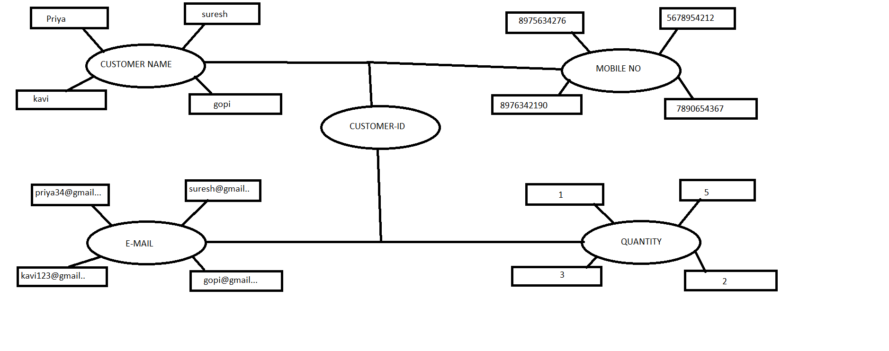
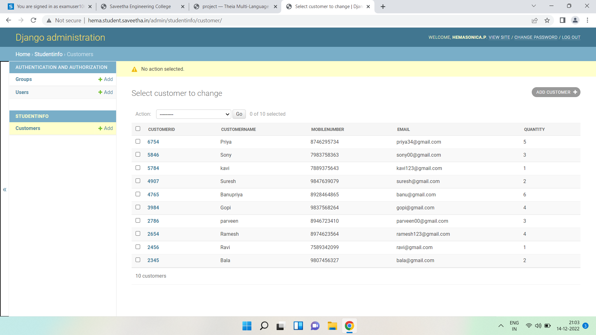

# Django ORM Web Application

## AIM
To develop a Django application to store and retrieve data from a database using Object Relational Mapping(ORM).

## Entity Relationship Diagram




## DESIGN STEPS

### STEP 1:
creating and collecting  datas from customer using django.

### STEP 2:
implementation using github

### STEP 3:
pushing into github


## PROGRAM
```


from django.db import models

# Create your models here. 
from django.db import models
from django.contrib import admin
# Create your models here.
class Customer(models.Model):
    customerid= models.CharField(max_length=8,primary_key=True)
    customername =models.CharField(max_length=100)
    mobilenumber =models.CharField(max_length=100)
    email=models.EmailField()
    quantity= models.IntegerField()
   

class CustomerAdmin(admin.ModelAdmin):
    list_display = ('customerid','customername','mobilenumber','email','quantity')


```

## OUTPUT:
   #### customerinfo


### program output


## RESULT
Thus the experiment was done successfully..
